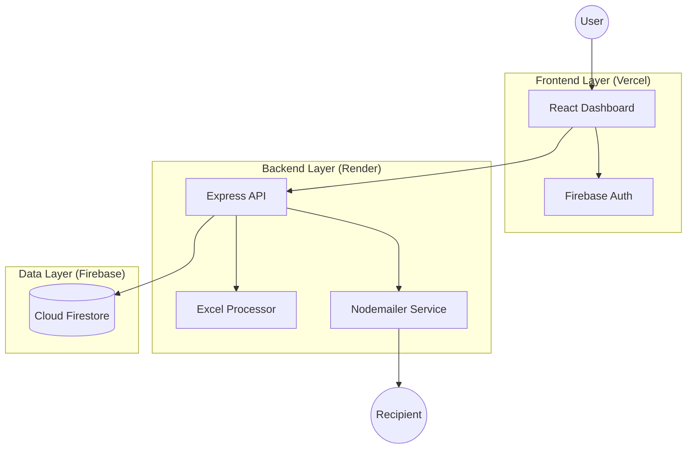

# Intelligent Workflow Automation Platform (WAP) - Comprehensive Documentation

## 1. Introduction
The **Intelligent Workflow Automation Platform (WAP)** is a sophisticated full-stack application designed to bridge the gap between static spreadsheet data and active business communication. By leveraging AI-powered heuristics and real-time cloud infrastructure, WAP allows organizations to automate repetitive outreach tasks (such as fee reminders, HR notifications, and event invitations) while maintaining a personalized touch.

## 2. System Architecture
The platform follows a modern **Decoupled Client-Server Architecture** utilizing a distributed cloud model.

---

## 3. Tech Stack Details

### Core Infrastructure
| Category | Technology | Usage |
| :--- | :--- | :--- |
| **Frontend** | React 19 (Vite) | Main application framework |
| **Backend** | Node.js (Express 5) | API and processing engine |
| **Database** | Firebase Firestore | Real-time NoSQL data storage |
| **Auth** | Firebase Authentication | Google SSO & Token verification |
| **Deployment** | Vercel & Render | Cloud hosting for UI and API |

### Libraries & Tools
- **UI/UX**: Tailwind CSS, Lucide React, Sonner (Toasts).
- **Data Visualization**: Recharts (Interactive charts).
- **Processing**: SheetJS (XLSX), Multer (FileUpload).
- **Communication**: Nodemailer (SMTP).

---

## 4. Project Modules

### 4.1. Authentication Module
- **Mechanism**: Google OAuth 2.0.
- **Client Side**: Uses Firebase JS SDK to manage user sessions.
- **Server Side**: Custom middleware verifies JWT ID tokens via Firebase Admin SDK to protect all API endpoints.

### 4.2. Upload & Analysis Module
- **File Parsing**: Handles `.xlsx` and `.xls` files.
- **AI Column Mapping**: Uses a keyword-based heuristic service to guess which Excel columns map to "Name", "Email", and "Balance".
- **Real-time Preview**: Displays a dynamic table of parsed data before the workflow starts.

### 4.3. Workflow Configuration Module
- **Templates**: Pre-defined logic for Fees, Tasks, HR, and Events.
- **Tone Engine**: Adjusts message subjects and bodies based on "Formal", "Friendly", "Urgent", or "Supportive" selections.
- **Omni-channel Support**: Logic ready for both Email (Nodemailer) and WhatsApp/External webhooks (n8n).

### 4.4. Analytics Dashboard
- **Real-time Metrics**: Aggregates data from `workflowRuns`.
- **Activity Tracking**: Visualizes message volume and success/failure rates over time.
- **AI Summary**: Provides a human-readable performance assessment of the latest execution.

---

## 5. Development & Deployment
- **Local Dev**: Includes a detailed Mock Database system in `firebaseConfig.js` to allow development without cloud keys.
- **Environment Management**: Robust support for `.env` files and cloud-based environment variables (supporting both raw JSON and file paths).

## 6. Future Roadmap
1. **Dynamic Prompt Engineering**: Allowing users to write custom AI prompts for message generation.
2. **Native WhatsApp Integration**: Implementing Twilio for direct WhatsApp Business messaging.
3. **Advanced Reporting**: PDF export functionality for workflow performance audits.

---
*Created by Antigravity AI - 2026*
